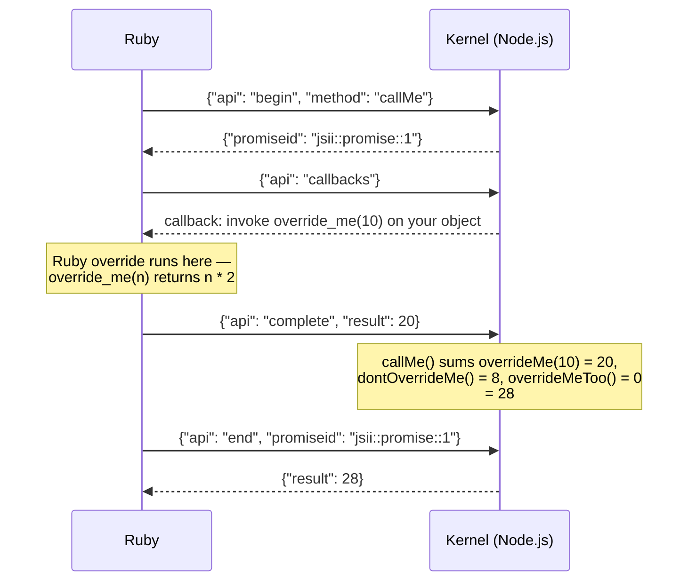

In the [last post](/blog/ruby-cdk/) I covered what jsii actually is: a Node.js sidecar holding the real objects, with every other language acting as a remote client speaking JSON-RPC over stdio. I ended with a list of problems that need solving to make Ruby a target (consolidating the three overlapping type-guard bullets into one):

- Garbage collection
- Naming
- Async semantics
- Inheritance (and multiple inheritance)
- Packaging with Rubygems
- Runtime type guards for untyped languages

This post takes on naming, type guards, async and packaging. Inheritance and garbage collection are meaty enough to get a post of their own.

Everything below is real generated output and real runtime code — the implementation passes the full jsii standard compliance suite, the same matrix that tracks Java and Go, and it deploys this blog's infrastructure in production.

## Naming

The easy part is the part everyone thinks of first: jsii members are `camelCase` on the wire, Ruby wants `snake_case`. So `bucketName` becomes `bucket_name` and `grantReadWriteData` becomes `grant_read_write_data`.

The subtlety is that this mapping has to work in **both directions**. When you override a method in Ruby and the host calls it, the kernel sends a callback carrying the *wire* name — and the runtime has to find your *Ruby* method. If the generator and the dispatcher ever disagree about the mapping, overrides silently stop firing. The two live in different codebases (TypeScript generator, Ruby runtime), so there's a test that literally parses the generator's source and asserts both sides carry an identical reserved-name table.

Module names go the other way — `PascalCase` — and that's where acronyms come in. CDK is full of them, and naive pascal-casing gives you `AwsS3` and `ApiGateway`, which is not in line with what a Rails developer might write. The acronym list is configured by the library author in `package.json`, alongside the rest of the jsii target config:

```json
{
  "jsii": {
    "targets": {
      "ruby": {
        "gem": "aws-cdk-lib",
        "module": "AWSCDK",
        "acronyms": ["AWS", "S3", "VPC", "API", "IPv4", "CIDR"]
      }
    }
  }
}
```

The generator applies the list at *word boundaries*:

```
awsIpv4Cidr  →  AWSIPv4CIDR     (three acronyms, three different boundaries)
AWSpecial    →  AWSpecial       (unchanged — "AWS" mid-word is not an acronym)
```

The second example matters more than the first. An acronym matcher without boundary rules will happily mangle every word containing "ce" once `CE` is on the list.

The acronym list gets the *derived* names right, but sometimes you don't want derivation at all — you want to say exactly what a submodule is called. jsii already has a convention for this: a `.jsiirc.json` file sitting next to the submodule's source, carrying per-language overrides. Ruby slots in as one more target alongside the existing ones. This is the actual file from `aws-cdk-lib/aws-s3` on my fork:

```json
{
  "targets": {
    "java":   { "package": "software.amazon.awscdk.services.s3" },
    "dotnet": { "namespace": "Amazon.CDK.AWS.S3" },
    "python": { "module": "aws_cdk.aws_s3" },
    "ruby":   { "module": "AWSCDK::AWSS3" }
  }
}
```

The compiler folds these into the assembly's submodule metadata, and the generator prefers an explicit module over anything it would have derived. One guard worth having: an explicit module must *extend* the assembly's root module (`AWSCDK::...`) — a config that tries to relocate a submodule outside it fails generation loudly, because silently emitting types into the wrong namespace is the kind of bug you find three packages downstream.

Then there are reserved words. jsii is allowed to have a method called `next`, because that's fine in TypeScript. It is not fine in Ruby. Those get a deterministic underscore prefix — and jsii's own compliance fixtures exercise this with deliberate cruelty. `JsiiCalc::Multiply` comes from `jsii-calc`, the fixture library every binding is tested against, where `next()` is its implementation of `IRandomNumberGenerator`:

```typescript
export class Multiply
  extends BinaryOperation
  implements IFriendlier, IRandomNumberGenerator
{
  // ...

  public next() {
    return 89;
  }
}
```

On the Ruby side:

```ruby
num = ->(n) { Scope::JsiiCalcLib::Number.new(n) }

multiply = JsiiCalc::Multiply.new(num.call(10), num.call(30))
multiply.value  # => 300
multiply._next  # => 89
```

The generated `_next` is nothing more than the renamed forwarding stub — calling it goes over RPC to that TypeScript `next()`.

Keywords aren't the whole story, though: **the runtime's own API is also a namespace you can collide with**. A jsii method named `initialize` would silently replace the generated constructor. A static named `allocate` would break proxy hydration. So the reserved list covers Ruby keywords *plus* the object-model hooks (`initialize`, `new`, `allocate`) *plus* the entire `jsii_` prefix, reserved for the runtime — which means generated code can never shadow a runtime method, including ones that don't exist yet.

## Runtime type guards for an untyped language

A reasonable assumption: Ruby is duck-typed, so the bindings must be too.

They aren't, and they can't be. The wire protocol is **nominally typed** — when you pass an object to something expecting `IBucket`, the kernel needs to know the fully-qualified interface names your object implements. "Responds to the right methods" is not serializable. So implementing a jsii interface in Ruby means declaring it:

```ruby
class MyBellRinger
  include JsiiCalc::IBellRinger   # ← this line is wire protocol, not decoration

  def your_turn(bell)
    bell.ring
  end
end
```

That `include` is what gets gathered up and registered with the kernel, so the JavaScript side can build a proxy honoring exactly that contract. It's also Ruby's most natural idiom for a contract — `Comparable` and `Enumerable` work the same way — which is a happy coincidence.

On top of the nominal layer sits runtime validation. Every generated method validates its arguments *before* the RPC happens, against type metadata extracted from the assembly:

```ruby
calc = JsiiCalc::Calculator.new('not props')
# => TypeError: Expected props to be of type JsiiCalc::CalculatorProps
```

You get a Ruby `TypeError` naming the parameter, instead of an opaque serialization failure from inside Node. Arrays are checked element-wise, maps value-wise, unions arm-by-arm.

For those checks to happen *before* the RPC, the generated gem needs to know each parameter's expected type at runtime — without loading the assembly file or asking the kernel. So the generator extracts the type reference for every parameter from the assembly and embeds it directly in the generated method. Here's the actual check inside `Calculator#initialize`:

```ruby
Jsii::Type.check_type(props, JSON.parse(Base64.strict_decode64(
  "eyJmcW4iOiJqc2lpLWNhbGMuQ2FsY3VsYXRvclByb3BzIn0=")), "props")
```

That Base64 blob decodes to plain jsii type metadata:

```shell
$ echo "eyJmcW4iOiJqc2lpLWNhbGMuQ2FsY3VsYXRvclByb3BzIn0=" | base64 --decode
{"fqn":"jsii-calc.CalculatorProps"}
```

Why encode it at all, rather than writing the JSON inline? Because this is *generated source code*, and the strings inside that metadata come from the assembly. Type references are mostly tame — fqns and primitive names — but a generator shouldn't have to reason about what every current and future shape of metadata might contain. Ruby double-quoted strings interpolate `#{...}`, single-quoted strings have their own escaping rules, and a generator that emits assembly-supplied text into string literals is one exotic character away from producing code that doesn't parse — or worse, code that *executes* something. Base64 sidesteps the entire class of problem: the alphabet is `[A-Za-z0-9+/=]`, nothing in it can ever escape a string, interpolate, or terminate a literal, no matter what the assembly contains.

Structs get the friendliest treatment. They generate as real value classes (keyword constructors, content-based equality), but call sites accept plain hashes and coerce them:

```ruby
Bucket = AWSCDK::AWSS3::Bucket

Bucket.new(self, 'MyBucket', versioned: true)   # hash in, validated struct out
```

The coercion is recursive — hashes inside arrays, maps, and unions where only one arm is a struct all get converted and validated on the way in:

```ruby
Bucket.new(self, 'Assets',
  cors: [
    # a plain hash, coerced to a CorsRule struct on the way in...
    { allowed_methods: [AWSCDK::AWSS3::HttpMethods::GET], allowed_origins: ['*'] },
    # ...or the same struct constructed explicitly — the two are
    # interchangeable, and can be mixed in the same array
    AWSCDK::AWSS3::CorsRule.new(
      allowed_methods: [AWSCDK::AWSS3::HttpMethods::PUT],
      allowed_origins: ['https://omarqureshi.net']
    )
  ],
  lifecycle_rules: [
    # each of these becomes a LifecycleRule
    { expiration: AWSCDK::Duration.days(90) }
  ]
)
```

And because the elements become real validated structs rather than passed-through hashes, mistakes surface immediately as Ruby errors with the member named:

```ruby
Bucket.new(self, 'Assets', cors: [{ allowed_origins: ['*'] }])
# => ArgumentError: missing keyword: :allowed_methods
```

The coercion isn't sugar, though — it's load-bearing. A coerced struct serializes to the kernel's wire format, camelCase keys and all:

```json
{
  "$jsii.struct": {
    "fqn": "aws-cdk-lib.aws_s3.CorsRule",
    "data": {
      "allowedMethods": [{ "$jsii.enum": "aws-cdk-lib.aws_s3.HttpMethods/GET" }],
      "allowedOrigins": ["*"]
    }
  }
}
```

(Note the enum member travelling as a `$jsii.enum` envelope carrying its fully-qualified name — wire values are never bare strings.)

A passed-through hash would have kept its Ruby-flavoured keys:

```json
{
  "allowed_methods": [{ "$jsii.enum": "aws-cdk-lib.aws_s3.HttpMethods/GET" }],
  "allowed_origins": ["*"]
}
```

— snake_case keys the kernel has never heard of, failing somewhere deep inside Node rather than at your call site. So hash-to-struct conversion is a correctness feature wearing an ergonomics costume.

## Async semantics

jsii methods can return `Promise<number>`. Ruby callers shouldn't have to care, and they don't — the runtime bridges it synchronously over the kernel's `begin`/`end` API, with the shared callback channel doing the work in between:



`begin` starts the promise, the runtime services callbacks while it's pending — that's the window where *your* Ruby overrides of async methods execute — and `end` collects the settled value. Exceptions thrown in your override reject the host-side promise and come back as `Jsii::RuntimeError`, message intact.

The deadlock case is handled too: if a *synchronous* callback tries to invoke an *async* method, the kernel refuses rather than wedging the single request pipe — and the compliance suite has three tests asserting precisely that refusal.

## Packaging with Rubygems

Each assembly generates a complete gem: code, YARD documentation (typed `@param`/`@return` tags sourced from the assembly docs — your editor's hover-docs work), and a gemspec built from the assembly's own metadata:

```ruby
# (trimmed)
Gem::Specification.new do |s|
  s.name        = 'aws-cdk-lib'
  s.summary     = 'Ruby bindings for aws-cdk-lib'
  s.authors     = ['Amazon Web Services']
  s.license     = 'Apache-2.0'
  s.required_ruby_version = '>= 3.3.0'
  s.add_dependency 'jsii-ruby-runtime', '~> 1.0'
end
```

npm version semantics translate to gem constraints (`^1.2.3` → `~>`-style ranges, prerelease tags → `.dev.`/`.alpha.` suffixes), and the gems version in lockstep with their npm counterparts.

This blog is the integration test: every deploy builds the stack — S3, CloudFront, ACM, Route53, Cognito, DynamoDB — through the generated `aws-cdk-lib` gem, on Ruby 4.0.

## Where this is going

The implementation is up as [an RFC tracking issue on aws/jsii](https://github.com/aws/jsii/issues/5129), with [a cdk-rfcs proposal](https://github.com/aws/aws-cdk-rfcs/issues/935) and PRs across the toolchain (compiler schema, monorepo, rosetta, docgen). The compliance matrix now has a Ruby column, and it is **fully compliant**.

Next time: inheritance — including what multiple inheritance even means when your objects live in another process — and the garbage collection story. After that, rosetta's Ruby translator, and the journey of getting a language target *upstreamed*, which is a different story from getting one *working*.
