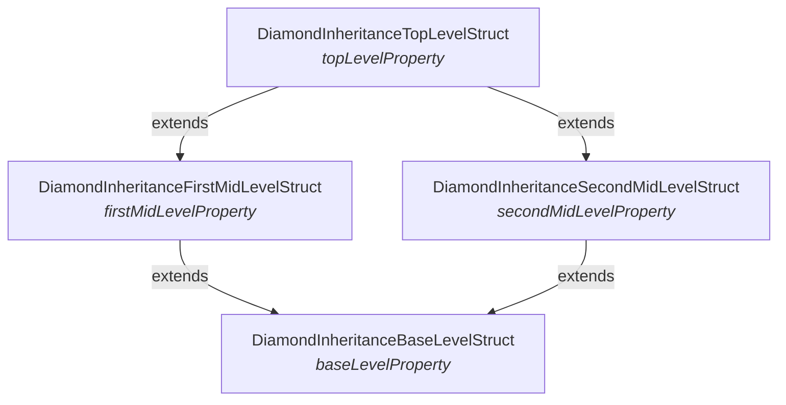
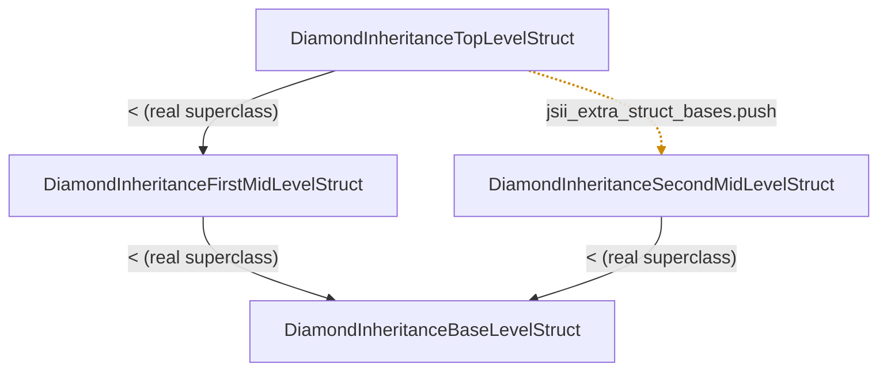

In the [first post](/blog/ruby-cdk/) I covered the core trick: a jsii object isn't really in your process. `new Bucket(...)` allocates a JavaScript object inside a Node.js sidecar, and your Ruby variable holds nothing but a handle — a `$jsii.byref` string pointing at it. Every method call is RPC.

[Last time](/blog/ruby-cdk-2/) I worked through naming, runtime type guards, async and packaging. This post takes on the two I deliberately set aside, because they're the two that bite hardest on that "your objects live somewhere else" fact:

- **Inheritance** — what does it mean to subclass a class, override its methods, or implement an interface, when the real object is in another process and another language?
- **Garbage collection** — who frees a jsii object, when it's referenced from both sides of the boundary and neither side can see the other's references?

One of these is solved with a surprising amount of machinery. The other is solved by, deliberately, doing almost nothing. Everything below is real generated output and real runtime code, passing the full jsii compliance suite.

## The easy mapping: single base, many mixins

jsii's type model is the same as Java's or TypeScript's: a class has **one** base class and implements **zero or more** interfaces. Ruby's object model is a near-perfect match — single superclass, plus any number of modules mixed in with `include`. So the mapping is almost mechanical.

`JsiiCalc::Multiply` from the compliance fixtures extends `BinaryOperation` and implements two interfaces:

```typescript
export class Multiply extends BinaryOperation
  implements IFriendlier, IRandomNumberGenerator { /* ... */ }
```

and the generator emits exactly that shape — the base becomes the Ruby superclass, each interface becomes an included module:

```ruby
class JsiiCalc::Multiply < ::JsiiCalc::BinaryOperation
  include ::JsiiCalc::IFriendlier
  include ::JsiiCalc::IRandomNumberGenerator
  self.jsii_fqn = "jsii-calc.Multiply"
  Jsii::Object.register_jsii_fqn("jsii-calc.Multiply", self)
  # ...
```

Behavioural interfaces *are* Ruby modules, and an interface that extends several parent interfaces just `include`s each of them — Ruby modules compose with no fuss. Multiple inheritance of interfaces is free, because Ruby already does it.

## Where Ruby can't follow: struct diamonds

The clean mapping breaks in one place: **structs**.

A jsii struct (a "data type") is passed by value, so [the last post](/blog/ruby-cdk-2/) covered how it generates as a real Ruby *class* — keyword constructor, content equality. But jsii structs support genuine multiple inheritance, including diamonds, and a Ruby class only has one superclass. The compliance suite has a textbook diamond:

```typescript
interface DiamondInheritanceTopLevelStruct
  extends DiamondInheritanceFirstMidLevelStruct,   // ┐ both extend
          DiamondInheritanceSecondMidLevelStruct { // ┘ ...BaseLevelStruct
  readonly topLevelProperty: string;
}
```

Four declared `extends` edges, two paths up to the base — the classic diamond:



The member side is a non-problem: `allProperties` flattens the whole hierarchy, so the generated constructor takes every field from every ancestor regardless of how they're wired. What multiple inheritance actually buys you that single inheritance doesn't is **type identity** — `top.is_a?(SecondMidLevelStruct)` has to be true even though Ruby can only put `FirstMidLevelStruct` in the superclass slot.

So the generator subclasses the *first* parent and records the rest in a side-table:

```ruby
class JsiiCalc::DiamondInheritanceTopLevelStruct < ::JsiiCalc::DiamondInheritanceFirstMidLevelStruct
  Jsii::Object.register_jsii_fqn("jsii-calc.DiamondInheritanceTopLevelStruct", self)
  jsii_extra_struct_bases.push(::JsiiCalc::DiamondInheritanceSecondMidLevelStruct)
  # ...
```

Exactly one edge survives as real Ruby inheritance (`<`); the lost diamond arm becomes a side-table entry:



The solid edges are the genuine `superclass` chain — `Top < First < Base`. The dashed edge is the arm Ruby can't express as inheritance, so `is_a?` has to recover it from the side-table. `Jsii::Struct` overrides `is_a?`, `kind_of?` and `===` to consult that table, recursively, alongside the real Ruby ancestry:

```ruby
def jsii_struct_conforms_to?(klass)
  return true if self <= klass
  return true if jsii_extra_struct_bases.any? { |base| base.jsii_struct_conforms_to?(klass) }

  superclass.respond_to?(:jsii_struct_conforms_to?) &&
    superclass.jsii_struct_conforms_to?(klass)
end
```

The payoff is that every declared parent answers `true`, whichever slot it landed in:

```ruby
top = JsiiCalc::DiamondInheritanceTopLevelStruct.new(
  base_level_property: 'b', first_mid_level_property: 'f',
  second_mid_level_property: 's', top_level_property: 't'
)

top.is_a?(JsiiCalc::DiamondInheritanceFirstMidLevelStruct)   # => true  (real superclass)
top.is_a?(JsiiCalc::DiamondInheritanceSecondMidLevelStruct)  # => true  (recorded extra base)
top.is_a?(JsiiCalc::DiamondInheritanceBaseLevelStruct)       # => true  (transitively, via both)
```

Overriding `===` is the part that's easy to forget — without it, `case struct when SomeParentStruct` silently takes the wrong branch, because `case` uses `===`, not `is_a?`.

## The real puzzle: overrides across the boundary

Here's the genuinely hard part. You subclass a generated class in Ruby and override one of its methods. The *real* object lives in Node. When TypeScript code inside the kernel calls that method on your object, it has to come **back** across the boundary and run *your* Ruby code — otherwise overriding would be a no-op, and polymorphism (the entire point of the CDK's construct model) wouldn't work.

For that to happen, the kernel needs to know — at construction time — exactly which members you've overridden. So `Jsii::Object#initialize` computes that list and ships it with the create call:

```ruby
@jsii_ref = Jsii::Kernel.instance.create_object(
  ruby_class.jsii_fqn, args,
  overrides:  jsii_overrides,   # ← "call these back into Ruby"
  interfaces: jsii_interfaces,
  instance:   self
)
```

The whole problem reduces to: **how do you tell, at runtime, that a Ruby method is a user's override rather than the generated forwarding stub?** The answer is the `native_override?` predicate — an override is a method whose owner is neither a generated jsii class nor a Ruby builtin:

```ruby
def native_override?(owner)
  return false if owner.nil?

  !ruby_class.registered_class?(owner) &&
    ![Jsii::Object, Jsii::Struct, Jsii::Enum, ::Object, ::Kernel, ::BasicObject].include?(owner)
end
```

There are two flavours of override, discovered two different ways.

**Subclass overrides** are the straightforward case. Every generated class emits a `jsii_overridable_methods` table — name, kind, optionality for each member it exposes:

```ruby
def self.jsii_overridable_methods
  {
    :to_string => { kind: :method, name: "toString", is_optional: false },
    # ...
  }
end
```

The runtime walks the ancestor chain, and for each overridable member checks whether the receiver's implementation owner is a user class. If it is, that member goes in the overrides list.

**Interface implementations** are the gnarly case. When you `include` a behavioural interface and implement its method, you're not overriding a generated stub — you're *providing* the body. But the kernel still needs the canonical wire name (`yourTurn`), and all you've given it is a snake_case Ruby method (`your_turn`). Where does the wire name come from?

It's hiding in the generated interface module. The `include` brought in a stub that does `jsii_call_method "yourTurn"`, and your method shadowed it — but the module still holds the original. So the runtime **disassembles the interface module's copy** and reads the wire name straight out of the bytecode:

```ruby
original_method = ancestor.instance_method(ruby_name)
disasm = RubyVM::InstructionSequence.of(original_method).disasm
# scan disasm for jsii_call_method / jsii_get_property to get the kind,
# and the `putstring "..."` operand to recover the canonical jsii name
```

Reaching into MRI bytecode to recover wire metadata is not something you reach for lightly, and it has a hard dependency: `RubyVM::InstructionSequence` is MRI-only. On JRuby or TruffleRuby it doesn't exist, so the runtime fails loudly and early rather than silently dropping overrides:

```ruby
raise 'jsii-ruby-runtime requires MRI (CRuby) — RubyVM::InstructionSequence ' \
      "is not available on #{RUBY_ENGINE}, so interface override discovery cannot work."
```

### Why `super` works

There's a subtlety that makes overrides actually usable. When you override an *inherited* method and call `super`, that has to forward to the kernel — to the original implementation. For `super` to resolve, the inherited method has to exist as a real method on an ancestor, not be conjured dynamically.

So the generator deliberately re-emits a forwarding stub for *every* member a class exposes, including inherited ones, walking the flattened `allProperties`/`allMethods`. It's O(depth × members) of generated code — a deep hierarchy repeats its ancestors' stubs at every level — and that bloat is the accepted price of `super` resolving to a real method that forwards over the wire.

Statics are the one exception: they're emitted only on their *defining* class. Ruby inherits singleton methods, which happens to match the ES6 static-inheritance semantics the kernel implements — and re-emitting an inherited static would bake the *derived* fqn into the kernel call, sending `Child.staticMethod` where the kernel expects `Parent.staticMethod`.

### The safety net

Not every member gets a generated stub. The kernel can hand back an object whose concrete type is anonymous — a return value typed only as some interface, with no generated class of its own. For those, `method_missing` dispatches dynamically: a setter (`name=`) becomes `set_property`, a no-arg call tries `get_property` then `call_method`, anything else is `call_method`.

The trap there is Ruby's implicit-conversion protocol. The interpreter and stdlib probe objects with `to_ary`, `to_str`, `to_hash` and friends to decide how to coerce them — and if `method_missing` dispatched *those* over the wire, you'd deadlock the kernel on a duck-typing check that was never meant to leave the process. So they're filtered out explicitly:

```ruby
RUBY_COERCION_METHODS = %i[
  to_ary to_a to_hash to_h to_str to_proc to_int to_io to_path to_open to_regexp
].freeze
```

Note what's *not* on that list: `to_string`, `to_json`, `to_array`. Those are common jsii member names that must dispatch normally — the filter is surgical, only the Ruby-runtime sentinels.

## Garbage collection: the trick is not having one

After all that machinery, garbage collection is almost an anticlimax — and that's the point.

Your Ruby proxy holds a `$jsii.byref` handle; the real object lives in V8. The obvious instinct is to mirror Ruby's lifecycle onto the kernel: attach a finalizer to the proxy, and when it's collected, tell the kernel to free the remote object. jsii even has an API for exactly that — a `del` request.

The runtime never calls it. The map from handle to proxy is a plain strong-reference `Hash`, deliberately:

```ruby
# This is intentionally a *strong*-reference Hash, not a weak map, and the
# runtime deliberately never issues the kernel's `del` call when a proxy is
# garbage-collected. A jsii object is referenced from both sides of the
# boundary, and the guest (Ruby) cannot know how many references the host
# (the Node sidecar, and TypeScript code running in it) still holds.
# Deleting a kernel object that the host still references would create a
# dangling reference there — a use-after-free the guest has no way to rule out.
def objects
  @objects ||= {}
end
```

That's the whole argument. A CDK construct you created in Ruby gets added to a tree, referenced by its parent, walked during synthesis — all on the host side, invisibly to you. If Ruby freed it the moment *your* last reference dropped, you'd pull it out from under the host. The guest simply has no way to know the host's reference count, so it can't safely free anything individually.

This isn't a Ruby cop-out — it's the universal answer. The Python runtime uses a strong dict with a comment that it "can never free the memory of JSII objects ever, because we have no idea how many references exist on the *other* side." The Go runtime defines a `Del` request and never calls it per-object. Everyone declines, for the same reason.

So what stops the process leaking forever? Wholesale cleanup. The proxies are freed all at once when the sidecar dies, and the runtime registers an `at_exit` hook to make that happen even if you never call `shutdown` yourself:

```ruby
at_exit do
  shutdown
end
```

`shutdown` closes the child's stdin — which is the jsii-runtime wrapper's intended EOF exit signal — waits for it to exit, and escalates to `SIGTERM` then `SIGKILL` if it won't go quietly. Every kernel object is freed in one stroke when the OS reclaims the child.

The reason this is acceptable rather than a memory-leak bug is the *shape* of the workload. jsii's bread and butter is `synth`: a program that builds a construct tree, serialises it to CloudFormation, and exits. It's short-lived and monotonic — it accumulates objects and then the whole process goes away. Per-object freeing would buy nothing but risk. A long-running server holding jsii objects for hours would be a genuinely different problem, but that's not what CDK is, and the runtime is honest about optimising for the case that exists.

## Where this leaves us

Both of these problems come from the same root — your objects live in another process — and they get opposite treatments. Inheritance needs real machinery to keep the illusion intact: a side-table for struct diamonds, override discovery that goes as far as disassembling bytecode, and a forwarding stub re-emitted at every level of the hierarchy so `super` lands somewhere real. Garbage collection needs the discipline to *not* build the obvious machinery, because the obvious machinery would be a use-after-free generator.

Next time: rosetta's Ruby translator — turning TypeScript example code in the docs into idiomatic Ruby.
