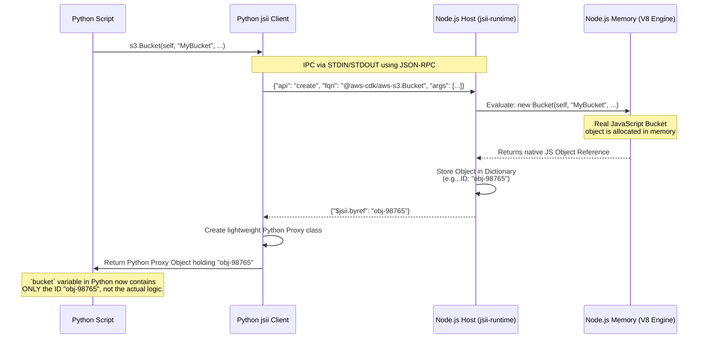

The year is 2010, DevOps isn't yet a broadly adopted term, engineering normally happens with people who are generalists. 

The frontend, the backend, the systems administrator, the DBA, the project manager, they're all one person. 

Rails is still big thanks to large projects like Github, Twitter and Basecamp. Ruby sat at the centre of DevOps tooling with Puppet, Chef and Github's onboarding tool ([Boxen](https://github.com/boxen)) being a glorified fork of Puppet.

By the mid-2010s, infrastructure tooling had shifted heavily toward Node.js and TypeScript. AWS CDK, CDK8S, and Pulumi all assumed JavaScript ecosystems first, while Ruby - once dominant in DevOps circles through Chef, Puppet, and Rails - slowly disappeared from the conversation.

Python won the ecosystem war, but for many Ruby developers it still lacks the expressiveness and ergonomics they were used to.

A language that is optimized for **developer happiness**:

```python
thislist = ["apple", "banana", "cherry"]
for x in thislist:
  print(x)
```

Compared to:

```ruby
%w(apple banana cherry).each { |f| puts f }
```

A language that gives semantic meaning to its methods:

```ruby
def all_ok?
  condition1 && condition2 && condition3
end
```

And `__init__.py` is unfortunately irksome.

This led me to a question: if jsii already powers CDK bindings for Python, Java, Go, and .NET, what would it actually take to add Ruby as a target?

The thing about `jsii` is that the TypeScript implementation is the first-class implementation, everything runs inside a Node.js process - TypeScript will create JavaScript objects so `new Bucket(...)` creates a bucket in memory but what does this mean for other languages?

There are 3 components that we care about:

- Runtime (and the Kernel)
- Pacmak (library generation)
- Rosetta (documentation generator)

Everything ultimately runs in Node.js.

It doesn't matter if you are using C# or Java or Python, everything is JavaScript. 

The way this works is by having a Node.js sidecar process which is always running, the other language does RPC over an IPC transport layer. Take the following CDK in Python:

```python
bucket = s3.Bucket(self, "MyBucket",
              bucket_name="my-unique-bucket-name",
              versioned=True,
              encryption=s3.BucketEncryption.S3_MANAGED
          ) 
```

if you were to look at the code for [s3.Bucket](https://pypi.org/project/aws-cdk-lib/#aws_cdk_lib-2.257.0-py3-none-any.whl) (unzip the whl file), you would see that it gathers properties for the bucket with pydoc documentation and then finally does

```python
jsii.create(self.__class__, self, [scope, id, props])
```

in terms of sequence, this looks like the following:



You can read the full [API specification](https://aws.github.io/jsii/specification/1-introduction/) to see what it expects as well as the caveats for different language implementations. 

Given this, you can see that by adding a language binding and proxy layer, you can write CDK in TypeScript and have it be re-usable in any targeted language! 

The tradeoff is that secondary language bindings are just remote clients talking to a Node.js process bringing in all the pain that goes with that such as IPC overhead and possibly unnatural APIs. This tradeoff is acceptable for infrastructure tooling since maintaining a single implementation of CDK is more important than synth speed.

The implementation primarily takes place in Pacmak `@jsii/packages/jsii-pacmak/lib/targets/{python,go,java,dotnet}.ts` where a Target is defined that can take a `.jsii` assembly file describing classes, methods, properties, and inheritance in language-neutral format and generate the implementation.

Think of the assembly as C++ headers but instead of generating machine code, the assembly generates stubs for the target language.

Additionally, Rosetta adds language specific documentation, converting TypeScript types into language-specific arguments and is part of the pacmak process as well. That way you can have target language generated documentation such as `pydoc` for Python, this is why you get IDE hints or REPL hints.

So - high level summary, but what does this mean for Ruby?

The key realization is that implementing Ruby support is not really about reimplementing AWS CDK semantics. Those already exist inside the Node.js runtime. The real problem is building a transport, proxy, and code-generation layer capable of making Ruby feel native while still interoperating with the jsii kernel.

All is not quite simple, the problems that need to be tackled around this are:

- Garbage collection
- Naming
- Async semantics
- Inheritance (and multiple inheritance)
- Packaging with Rubygems
- Runtime type guards for untyped languages
- Dynamic type validation
- Untyped runtime guards

In the next post, I'll look at what that actually entails.
